# Introduction
Hello my name is Kyaw Nyi Nyi (knyi9181).

Welcome to my ReadMe file, this website is an microsite about my city that I grew up in and what it offers to the people who would like to visit here someday. In this document, I'll be going through the iterative process from the previous assignment of website proposal, the changes and improvements that I made, challenges that I faced and the reason behind my design process as a whole while coding this site.

## Navigation Bar & title with wallpaper
The navigation bar with the title of the homepage remained the same in the final design as it was in the protoype design. Replicating the design was easy for me to do as it doesn't required a lot of changes in the CSS styling. 

One noticable change that I did was instead of showing an underlined over the clicked navbar I added, hover effect instead. The reason for making it hover instead of having a static underline to show the user that they're on the click page is becuse I realized that there is already the title and wallpaper section of the page the user is at. In my perspective having two indicator to show where the user are is redundant so there for I decided to go with hover effect instead. 

**Prototype design showing selection of destination tab**
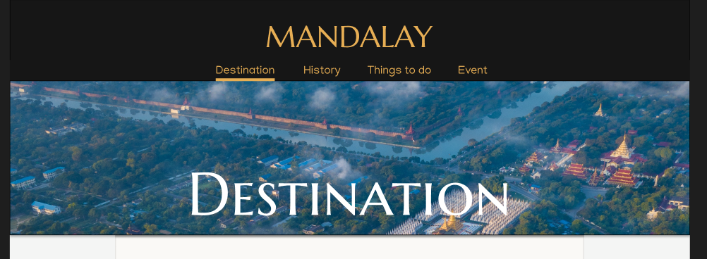

**Final design showing selection of destination tab from hover**
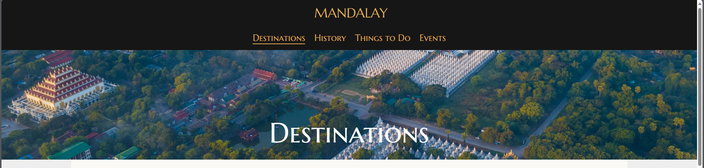

One last thing that was wasn't put into the final design was the sticky navigation bar that I have originally planned for the final design. The sticky navitation bar didn't make the final cut because it requires javascript. I haven't learn how to utilize javascript to create a sticky navbar, I tried watching youtube to help me with it but I wasn't able to replicate it so I decided to not put it. Also another reason was that it is not on my top priority list to put design as I already have navigation bar I wanted so I didn't put it. I will come back again and try adding it in future if I want to improve this site.

One last changes that I made for the nav bar is the removal of the 3 line button when the resolution is resize to mobile layout. The reason for removal is due to requirement of javascript and I'm not proficient enough to use javascript so I decided to scrape it and use clamp() instead of media queries to size down the fonts of the nav bar. The discovery of clamp was a huge life saver for me. It remove the needs of using multiple lines of media queries code to adjust the website responsive layout.It really help me save energy and time in this project. I would be using a lot of media queries in the project.

**Mobile resizing of navbar**
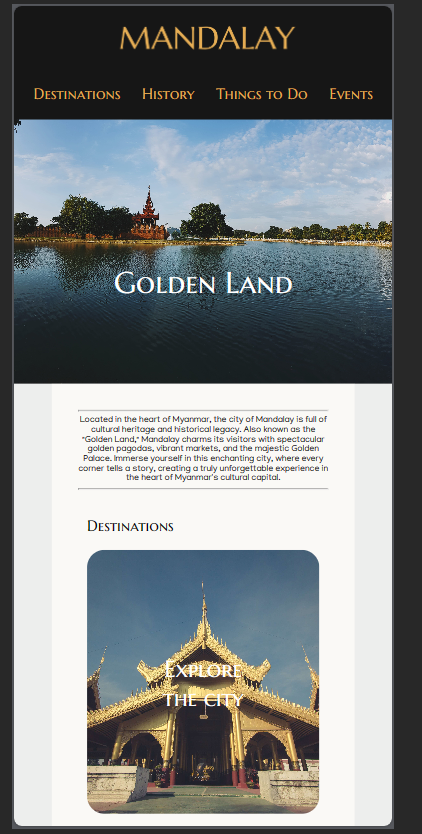

## Homepage
There were sinificant changes made in the homepage final design compared to the prototype design. The biggest changes that was noticeable was the layout design of the homepage. 

**Prototype design of homepage**

**Final design of homepage**
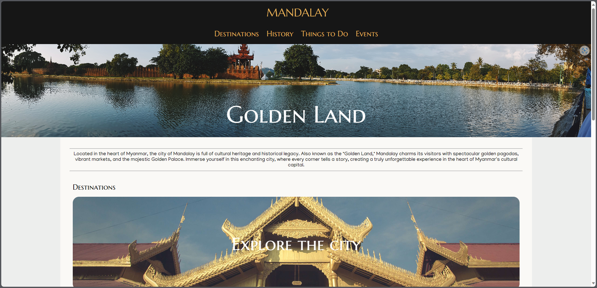
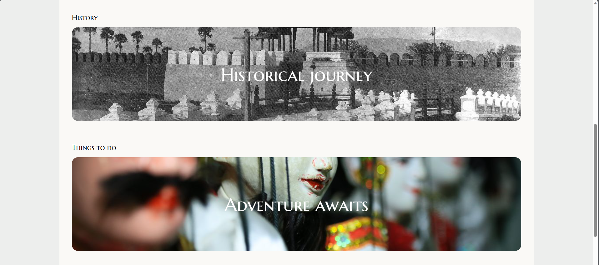
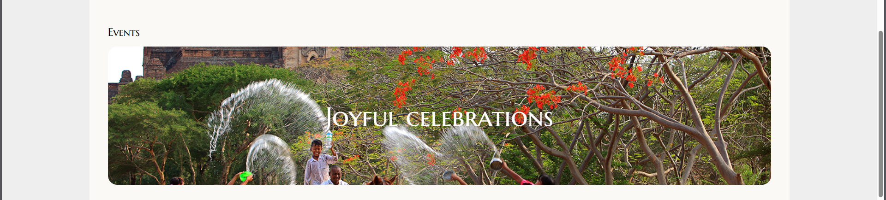

The new addition to the homepage was having the introductory paragraph section on the beginning of the page. The design choice for adding it was because in the prototype design, there wasn't anything for the users to introduce except rows of sections of clickable buttons. I wanted to users to get the first impression of the city through an introduction paragraph and understand mroe about the city so therefore it was added into it.

The layout of home page changes from a webpage with multiple section of row of lists that could be clicked to show all the list for each section, and taking the user to the designated webpage to having 4 sections of large buttons that could be click to the designated webpage. The reason for this changes was that I felt there were way too many lists to select from in the prototype design and that, the homepage would have all the content congested in the single area. I don't want to congest all the content in the page as the main purpose of my original design is to have digestable content, so therefore I decided to make 4 sections of clickable buttons that would bring to the designated webpage. I also added the hover effect to the buttons where the image will expand when it is hover before clicking. I added this to have more animations to signal the user that the button is clickable to the users.

## Destinations
The changes to the destinatinon page was interesting for me. There were some noticeable changes made from prototype design to final design. 

**Prototype design of destination page**

**Final design of destination page**
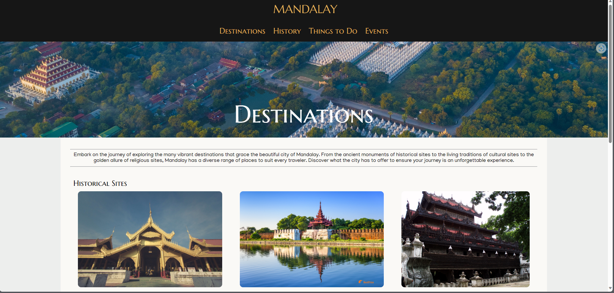
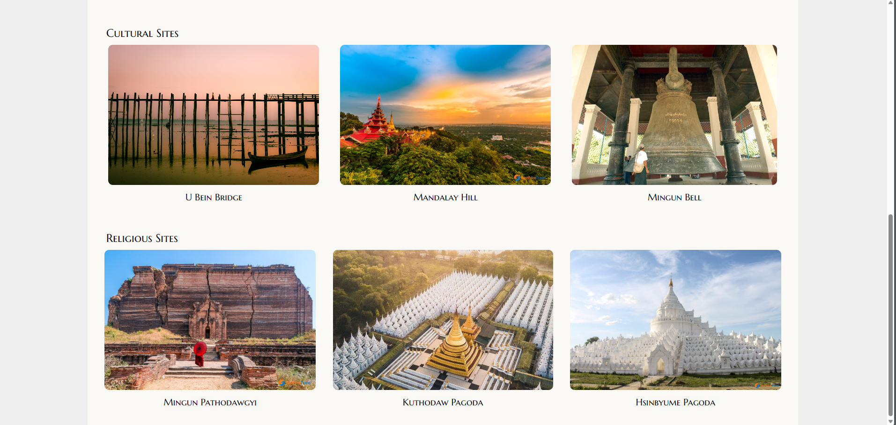

One new thing you'll notice is the addition of introductory paragraph in the destination page. The reason for adding it is to show give some first impression for the users to reason and know about the destination they can visit before browsing through the webpage.

The changes that were made were the removals of the popular attractions, and 3 sections of sites that would bring into different new pages. Instead I decided to do 3 sections of rows of places. The reason for removal of popular attractions sections and the 3 buttons that would bring to a different webpage is because after doing more extensive research about Mandalay. There aren't enough locations to warrant having more webpages to include lists of locations. The city itself is also small compared to many big cities across the words. Due to the limiation of available places to travel in the city I decided to only have 3 sections that represent different themes, where each section have a row of 3 places. One thing you'll notice is that the title are not on the image anymore and instead it was below the the images. I did it because, I would like to have a clear difference between a button and a content post to make things consistent and also have better learnability for the user to understand but some exceptions will apply as well.

Designing the rows in the css, I had to make the css display property to flex instead. The reason for using flexboxes is because I also have to make it responsive. With flexbox, the section row of content can be automatically adjusted into column of contents making it quite responsive for the moble layout size.

**Final design of destination page mobile layout**
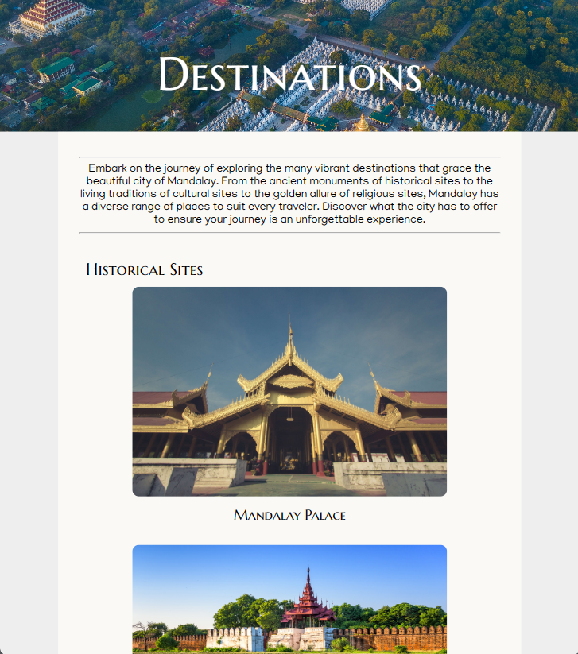

## History
The history section is quite similar to the design of the prototype of the website. Except for some text layout styles of the brief history and geography, I decided to make them the same so that is easier to manage in coding and also the image I have for the history paragraph happen to be same resolution size as geography so I tried to make it consistent. 

The noticeable change that I made was the removal of the timeline. The reason for the removal of the timeline section was because the history section already explains about the city history. The city is nearly 200 years old but most of the history are in the start of the city origin and not much later on. Having a timeline would congest all the event on the beginning and have a wide space near the present date and the history section does the job of explaning so therefore I decided to not included in it. 

**Prototype design of history page**

**Final design of history page**
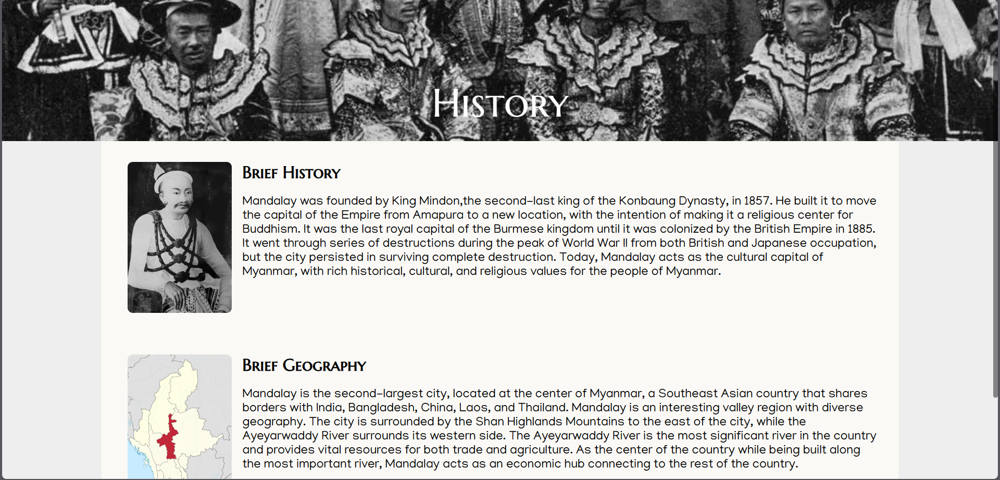

Making the history section text and images was the annoying part of creating this website. I made my job harder than it is when I was trying to wrap the text around the image using flexbox instead of using float function. It took a couples of hours of researching to figure our why it wasn't working and why float and flexbox functions cant be stacked. I had to use float functin because I wanted to make my image and text more responsive and wrap around the text when it is scaled down. I also have to make the display inline block after using the float value because the grography text would wrap around the image of brief history instead of starting in a different section, this was also another annoying part of figure out.

**Final design of history page mobile layout**
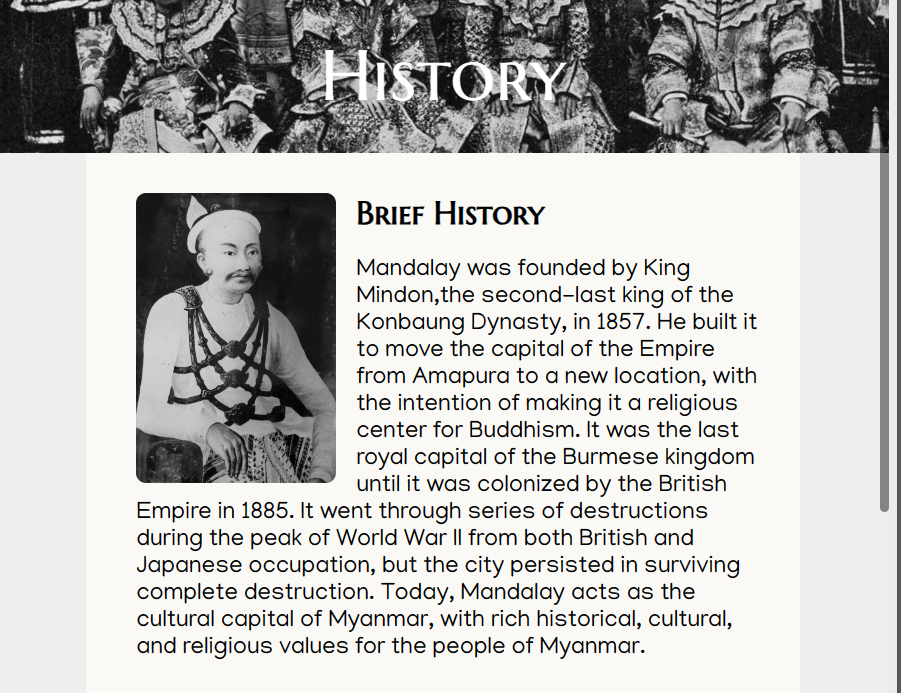

## Things to do
The things to do section remain quite similar except for the text layout style. 

**Prototype design of thigns to do page**

**Final design of things to do page**
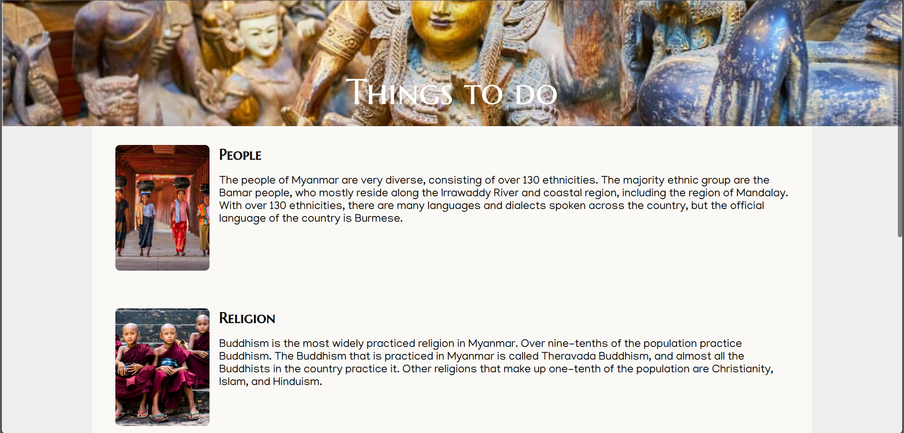
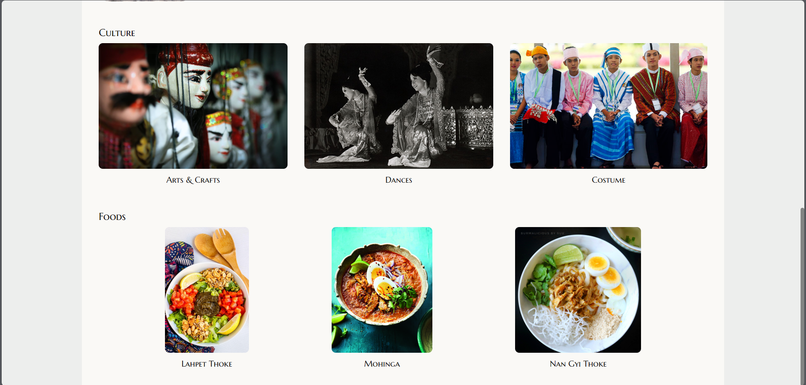

Instead of having alternating image to text and text to image style for the people and religion section, I decided to make it consistent design to make it easier to read. The codes for the people and religion sections are reused from the history page beacuse I wanted to design those two section to make their paragraph wrap around the image when it is shrink down for responsive design. 

Another change you might notice is that instead of having a clickable buttons with text inside and a section of rows of two content for culture and food sections, I decided to make it image and captions layout with a section of rows of 3 contents. I decided to fit all of the content in the same row instead of needing a new page to show all the list. The design choice for this is I wanted to make things consistent with the content row from destination page. I reused the code for responsiveness as well for the mobile layout too. 

Beside addition of content in the row and some changes to the paragraph layout. The history page remain similar to the prototype design.

**Final design of things to do page mobile layout**
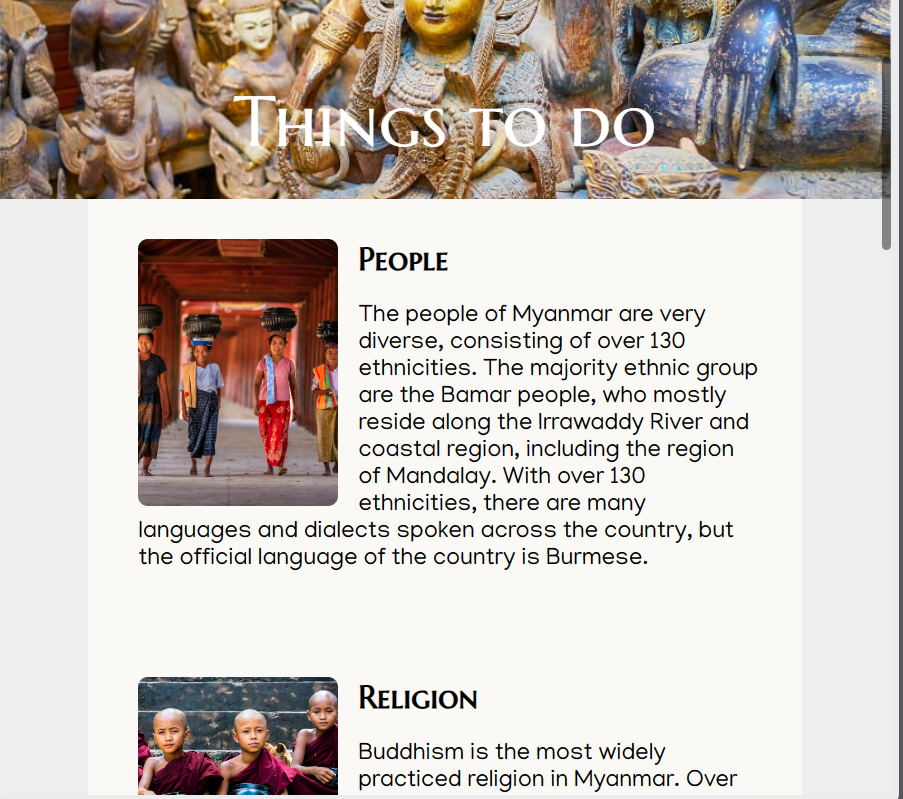

## Events
The event section remains quite similar to the original design of the prototype. Except for the content row sections where the text are not on the image and instead it is below the image.

**Prototype design of event page**

**Final design of event page**
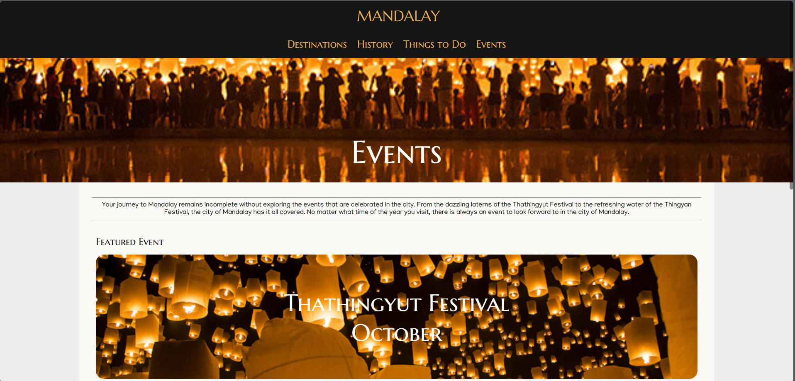
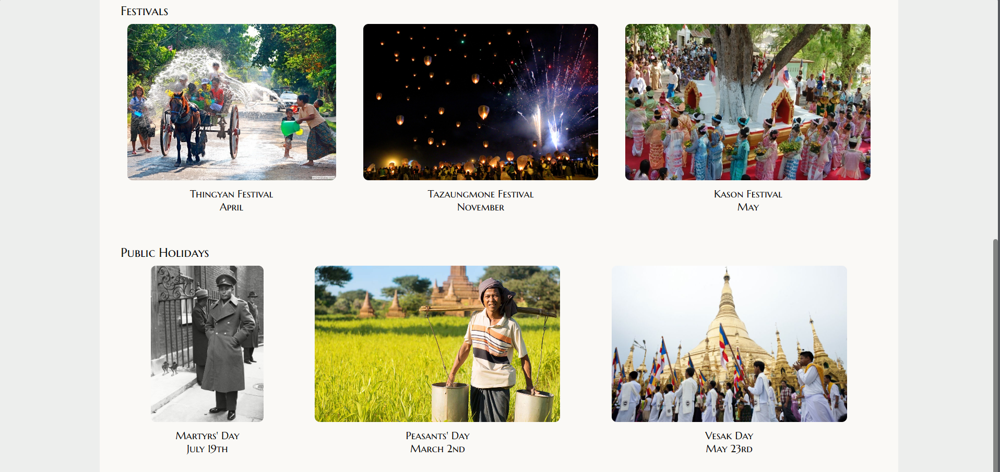

The design choice is similar to previous other webpages. I wanted to make things consistent by having a difference between clickable button and a content post with image and caption. The only exception applied to this is the featured event section. Where the image can be hover upon and will scale up but it is not clickable either. The design is for asthetic reason where I believe that having the feature event having some animation would give a better first impression of the feature event to the user. Another noticeable thing you'll notice in final design is the addition of the introductory paragraph, like any other introductory paragraph in this site, it is used to set the first impression for the users to read and know about the events in the city of Mandalay.

**Final design of event page mobile layout**
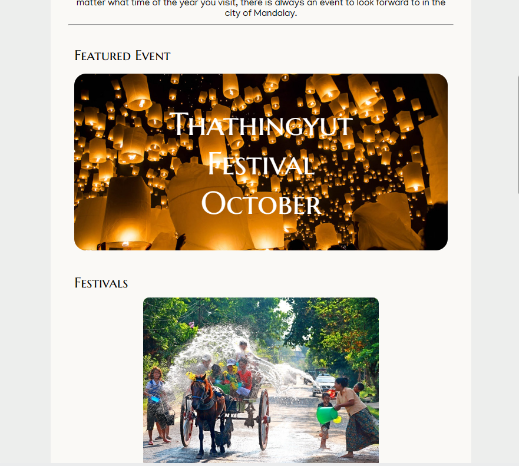

The row of contents are codes that are reused from other webpages where it is displayed in flex mode so the content and wrap when the webview is resize to make it more responsive.

## Reflection
Overall the coding was fun challenge for me to showcase the city that I grew up and love. I wish I did more self coding outside of the class to have a better understanding of how html and css work and maybe I could also have utilize the java script as well to make my website even better. Coding the CSS was a big challenge for me as I have to relearn them over youtube to property understand the flexbox system and how some styling works. As I code more webpage I was able to learn more about how it works which felt practical to me. 

The content of the lessons doesn't feel enough for me to learn until I was actually coding the final project. I wish there was more website coding example instead of tutorials games for me to learn, even though the tutorial stuff help me learn, I needed something more practical. The content from reading and lecture were alright but I needed more hands on examples. 

Also getting my marks and feedback for previous project really late wasn't helpful either as I couldn't make much changes based on feedback from my score and instead I have to ask my friends on their feedbacks and how I should improve upon it. Peer review is helpful but I could've use more feedback from my score to improve earlier.

Another big challenge for me was not being able to code exactly the way I wanted with html and css. I wanted to follow exactly how I had designed for the prototype design but I think I need more experience in it. Sometime cropping images and laying them out in the layout I want is very hard for me so I had to make changes to the design. Using alternative ways also termendously help me learn in coding as well. 

I think I will have to come back to this project in future, I want to properly improve on this. Coding this as my very first website is fun but I wish I could do better, but overall I'm happy with it.

## References
Aerial view of Mandalay Myanmar · Free Stock Photo - PEXELS. (n.d.-a). [https://www.pexels.com/photo/aerial-view-of-mandalay-myanmar-5538931/](https://www.pexels.com/photo/aerial-view-of-mandalay-myanmar-5538931/)

admin. (2019, April 12). 2019 Myanmar Traditional Festival will be celebrated near Information Counter of Ancient City. Ministry of Hotels & Tourism Myanmar. [https://tourism.gov.mm/de/2019-myanmar-traditional-festival-will-be-celebrated-near-information-counter-of-ancient-city/](https://tourism.gov.mm/de/2019-myanmar-traditional-festival-will-be-celebrated-near-information-counter-of-ancient-city/)

Bruce, R. (n.d.). King Mindon of Burma | History Today. Www.historytoday.com. Retrieved November 12, 2023, from [https://www.historytoday.com/archive/king-mindon-burma](https://www.historytoday.com/archive/king-mindon-burma)

Burmese dance. Asian Traditional Theatre Dance. (n.d.). [https://disco.teak.fi/asia/burmese-dance/](https://disco.teak.fi/asia/burmese-dance/)

Burmese monks. Flickr. (2023, October 15). [https://flic.kr/p/ZpbtMb](https://flic.kr/p/ZpbtMb)

Cloutman, V. (2020, October 28). Thingyan: A survival guide for the Burmese New Year: Insideburma blog. InsideAsia Blog. [https://www.insideasiatours.com/blog/thingyan-a-survival-guide-for-burmese-new-year](https://www.insideasiatours.com/blog/thingyan-a-survival-guide-for-burmese-new-year)

Depper, S. (2009, August 19). Shwenandaw Monastery. Flickr. [https://flic.kr/p/6Uic7r](https://flic.kr/p/6Uic7r)

Encyclopædia Britannica, inc. (2023, September 18). Aung san. Encyclopædia Britannica. [https://www.britannica.com/biography/Aung-San](https://www.britannica.com/biography/Aung-San)

HD wallpaper: AEC, Art, ASEAN, Asia, cultural, famous landmark, Indochina free download. Free download | HD wallpaper: aec, art, asean, asia, cultural, famous landmark, indochina | Wallpaper Flare. (n.d.). [https://www.wallpaperflare.com/aec-art-asean-asia-cultural-famous-landmark-indochina-wallpaper-sixkr/download](https://www.wallpaperflare.com/aec-art-asean-asia-cultural-famous-landmark-indochina-wallpaper-sixkr/download)

HD wallpaper: Myanmar (burma), Mandalay, water, tree, sky, plant, cloud - sky free download. Free download | HD wallpaper: myanmar (burma), mandalay, water, tree, sky, plant, cloud - sky | Wallpaper Flare. (n.d.). [https://www.wallpaperflare.com/myanmar-burma-mandalay-water-tree-sky-plant-cloud-sky-wallpaper-edybr/download](https://www.wallpaperflare.com/myanmar-burma-mandalay-water-tree-sky-plant-cloud-sky-wallpaper-edybr/download)

HD wallpaper: U bein bridge sunrise walker, black boat beside a wooden bridge free download. Free download | HD wallpaper: U Bein Bridge Sunrise Walker, black boat beside a wooden bridge | Wallpaper Flare. (n.d.). [https://www.wallpaperflare.com/u-bein-bridge-sunrise-walker-black-boat-beside-a-wooden-bridge-wallpaper-zujoj/download](https://www.wallpaperflare.com/u-bein-bridge-sunrise-walker-black-boat-beside-a-wooden-bridge-wallpaper-zujoj/download)

Hpone, W. Y. (2023, February 2). Toward a more perfect union in Myanmar. The Irrawaddy. [https://www.irrawaddy.com/opinion/guest-column/toward-perfect-union.html](https://www.irrawaddy.com/opinion/guest-column/toward-perfect-union.html)

Hsinbyume Pagoda Mandalay: Travel Information 2023. (n.d.). BestPrice Travel. Retrieved November 11, 2023, from [https://www.bestpricetravel.com/travel-guide/hsinbyume-pagoda.html](https://www.bestpricetravel.com/travel-guide/hsinbyume-pagoda.html)

Katz, A. (2021, September 16). Burma superstar tea leaf salad. Veggies Save The Day. [https://www.veggiessavetheday.com/burma-superstar-tea-leaf-salad/](https://www.veggiessavetheday.com/burma-superstar-tea-leaf-salad/)

Khin, S. (2023, February 12). Nan Gyi Thoke - Thick Rice Noodle Salad. Burmalicious by Suu. [https://www.theburmalicious.com/blog/burmese-thick-rice-noodle-salad](https://www.theburmalicious.com/blog/burmese-thick-rice-noodle-salad)

Kuthodaw Pagoda is also called "the world's largest book", named after the 729 marble slabs i. (n.d.). Yangon. [https://www.hotels-g.com/yangon/instagram/kuthodaw-pagoda-is/](https://www.hotels-g.com/yangon/instagram/kuthodaw-pagoda-is/)

Leinbach, T. R., Bhardwaj, S. M., & Owen, L. (2013, May 12). Irrawaddy River | river, Myanmar. Encyclopedia Britannica. [https://www.britannica.com/place/Irrawaddy-River](https://www.britannica.com/place/Irrawaddy-River)

Lush, E. (2021, December 5). 7 unique Myanmar experiences for cultural travellers. Wander. [https://wander-lush.org/unique-myanmar-culture/](https://wander-lush.org/unique-myanmar-culture/)

Mandalay | Myanmar | Britannica. (n.d.). Www.britannica.com. [https://www.britannica.com/place/Mandalay-Myanmar](https://www.britannica.com/place/Mandalay-Myanmar)

Mandalay Hill mandalay: Travel information 2023. BestPrice Travel. (n.d.-a). [https://www.bestpricetravel.com/travel-guide/mandalay-hill.html](https://www.bestpricetravel.com/travel-guide/mandalay-hill.html)

Mandalay Palace mandalay: Travel information 2023. BestPrice Travel. (n.d.-b). [https://www.bestpricetravel.com/travel-guide/mandalay-palace.html](https://www.bestpricetravel.com/travel-guide/mandalay-palace.html)

Mingun Bell (The world's largest ringing bell). (n.d.). Www.myanmartours.us. Retrieved November 11, 2023, from [https://www.myanmartours.us/destinations/mingun-travel/mingun-attractions/mingun-bell/](https://www.myanmartours.us/destinations/mingun-travel/mingun-attractions/mingun-bell/)

Mingun Mandalay: Travel information 2023. BestPrice Travel. (n.d.-c). [https://www.bestpricetravel.com/travel-guide/mingun.html](https://www.bestpricetravel.com/travel-guide/mingun.html)

Mohinga (Burmese fish soup). delicious. magazine. (n.d.). [https://www.deliciousmagazine.co.uk/recipes/mohinga-burmese-fish-soup/](https://www.deliciousmagazine.co.uk/recipes/mohinga-burmese-fish-soup/)

Myanmar tours & vacations, tailor-made for you. Tourlane. (n.d.). [https://www.tourlane.com/asia/myanmar/](https://www.tourlane.com/asia/myanmar/)

Myint-U, T. (2017, June 17). Myanmar, an unfinished nation. Nikkei Asia. [https://asia.nikkei.com/Politics/Myanmar-an-unfinished-nation](https://asia.nikkei.com/Politics/Myanmar-an-unfinished-nation)

Peasants' day 2024, 2025 and 2026 in Myanmar. PublicHolidays.asia. (2023, October 16). [https://publicholidays.asia/myanmar/peasants-day/](https://publicholidays.asia/myanmar/peasants-day/)

Shaw, T. (2020, January 1). Full moon day of Thadingyut in Myanmar in 2023. Office Holidays. [https://www.officeholidays.com/holidays/myanmar/full-moon-day-of-thadingyut](https://www.officeholidays.com/holidays/myanmar/full-moon-day-of-thadingyut)

Singer, N. F. (2011, July 31). File:Mandalay Palace entrance.JPG - Wikipedia. Commons.wikimedia.org. [https://en.m.wikipedia.org/wiki/File:Mandalay\_Palace\_entrance.JPG](https://en.m.wikipedia.org/wiki/File:Mandalay_Palace_entrance.JPG)

Springer, K. (2017, May 10). Vesak Day: Celebrating the life of Buddha. CNN Travel. [https://edition.cnn.com/travel/article/buddha-birthday-vesak-day/index.html](https://edition.cnn.com/travel/article/buddha-birthday-vesak-day/index.html)

Stephen. (2019, August 30). Traditional Dress of Myanmar - Essence of A Unique Culture. Myanmar Tours. [https://www.gomyanmartours.com/traditional-dress-myanmar/](https://www.gomyanmartours.com/traditional-dress-myanmar/)

Tazaungmon Full Moon Festival – Ministry of Hotels & Tourism Myanmar. Ministry of Hotels Tourism Myanmar. (n.d.). [https://tourism.gov.mm/november-festivals/tazaungmon-full-moon-festival/](https://tourism.gov.mm/november-festivals/tazaungmon-full-moon-festival/)

Tran, J. (2023, August 31). The Kason Festival: Full Moon Day. BestPrice Travel. [https://www.bestpricetravel.com/travel-guide/the-kason-festival-2462.html](https://www.bestpricetravel.com/travel-guide/the-kason-festival-2462.html)

Travel in Myanmar - tourism Myanmar. (n.d.-b). https://tourisminmyanmar.com.mm/

Wikimedia Foundation. (2023, September 19). Mandalay. Wikipedia. [https://en.wikipedia.org/wiki/Mandalay](https://en.wikipedia.org/wiki/Mandalay)

TUBS. (2011, October 1). Deutsch: Lage der Verwaltungseinheit XY (siehe Dateiname) in Myanmar. Wikimedia Commons. [https://commons.wikimedia.org/w/index.php?curid=16824034](https://commons.wikimedia.org/w/index.php?curid=16824034)

#